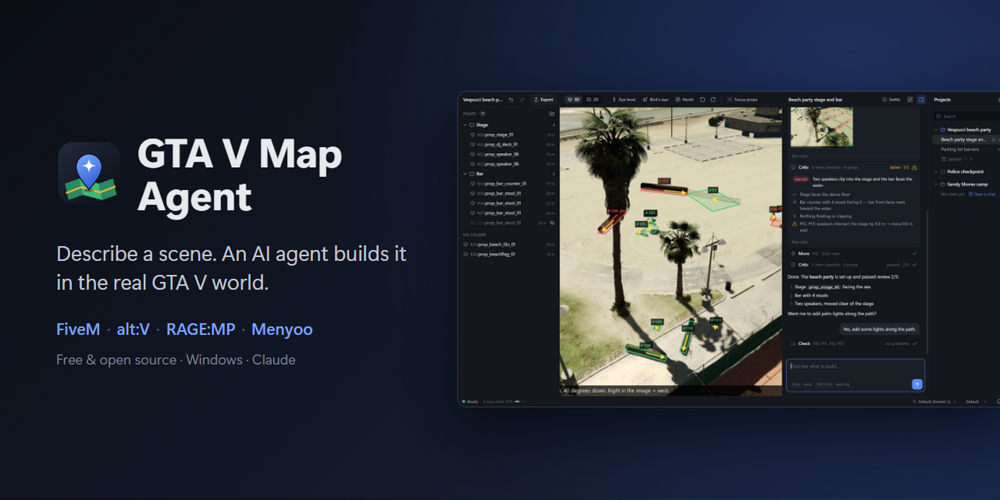
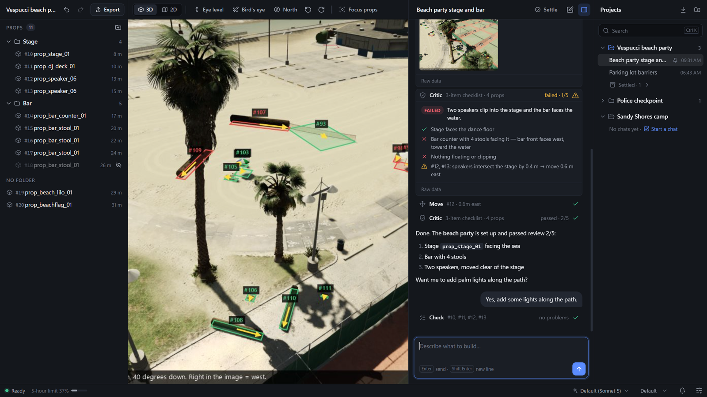

# GTA V Map Agent



**Build GTA V maps by describing them. An AI agent places the props in the real game world, checks its own work and exports a ready-to-use FiveM, alt:V or RAGE:MP resource.**

GTA V Map Agent is a free, open-source AI map editor for GTA V on Windows. Fly the camera to a spot in Los Santos, type *"set up a small camp here: a fire in the middle, three benches facing it, two tents behind"*, and a Claude agent searches the game's props, places them, checks them for collisions and floating, looks at the result from several angles and fixes it until an independent reviewer accepts it. No mapping experience or CodeWalker knowledge needed. You get a `.ymap` and a server resource you can drop in.

[](https://github.com/cngil/gtav-mapagent/actions/workflows/ci.yml)
[](LICENSE)


## Why

- **Mapping is slow.** Placing, rotating and snapping dozens of props by hand in CodeWalker or Menyoo takes hours. Describing the scene takes a sentence.
- **Props end up in walls or in the air.** Every placement is checked against real game geometry (other props, buildings, the ground), and the agent fixes what doesn't fit.
- **One map, many servers.** The same scene exports to FiveM, alt:V, RAGE Multiplayer, Menyoo for singleplayer, a plain `.ymap` or JSON.

## Features

- **Chat-driven building**: describe what you want where the camera is; ask for changes ("move the tents 2 m back", "make it look like a riot aftermath").
- **Real GTA V world**: the 3D view is [CodeWalker](https://github.com/dexyfex/CodeWalker) rendering your own game files, embedded in the app.
- **Self-checking agent**: geometric validation after every placement (overlaps, clipping into buildings, floating, buried, steep ground), annotated screenshots from several viewpoints, and an **independent AI critic** that passes or fails the scene against your request.
- **Projects and chats**: every map is a project with its own chats, saved automatically. Reopen a chat days later and continue where you left off; *settle* finished ones so they stay read-only.
- **Scene panel**: all props in folders, show/hide, delete, drag between folders, one-step undo/redo per request.
- **Export** to FiveM, alt:V, RAGE:MP, Menyoo, `.ymap` or JSON with one click.
- **Your own Claude account**: runs locally through Claude Code. No API key, no server of ours.



## Requirements

- Windows 10 or 11, x64, a DirectX 11 GPU
- GTA V for PC, installed (the game files are read from it, never changed)
- [.NET SDK](https://dotnet.microsoft.com/download) (tested with 9; builds the bundled CodeWalker)
- [Node.js](https://nodejs.org) 18 or newer
- [Claude Code](https://code.claude.com), installed and signed in (run `claude`, then `/login`). The agent uses that sign-in; a Claude subscription works, no API key needed.

## Install

```sh
git clone https://github.com/cngil/gtav-mapagent.git
cd gtav-mapagent/editor
npm install
npm run start:all
```

`start:all` builds CodeWalker and the editor and starts the app. On the first run CodeWalker asks for your GTA V folder once. Loading the world takes a little while.

Later, `npm start` is enough. After pulling CodeWalker changes, close the app and run `npm run start:all` again.

## Use

1. **Fly the camera** to where you want to build: click the 3D view, then WASD and the mouse. The toolbar has 3D/2D map view, eye level, bird's eye, north and orbit.
2. **Describe the scene** in the chat. The agent shows its acceptance checklist, builds, looks at the result (thumbnails in the chat, click to enlarge) and asks the critic to review it.
3. **Refine** by chatting: "the benches should face the fire", "add some lights along the path".
4. **Export** (top of the scene panel): pick a platform and a name.

| Platform | What you get | Install on your server |
|---|---|---|
| **FiveM** | resource with `fxmanifest.lua` and the streamed `.ymap` | copy to `resources/`, add `ensure <name>` to `server.cfg` |
| **alt:V** | `dlc` resource with `resource.toml`, `stream.toml` and the `.ymap` | copy to `resources/`, add it to `resources` in `server.toml` |
| **RAGE:MP** | server package that spawns the props with `mp.objects.new` | copy to `packages/` |
| **Menyoo** (singleplayer) | Object Spooner placements `.xml` | copy to `Grand Theft Auto V\MenyooStuff\Spooner`, load it in Menyoo |
| **JSON** | model, hash, position, rotation and quaternion of every prop | read it from your own scripts or tools |
| **.ymap only** | the map file | OpenIV, or your own dlcpack |

Exports are written to the project folder (`maps/<project>/exports/<platform>/`). FiveM and alt:V stream the `.ymap` itself; RAGE:MP, Menyoo and JSON spawn the same props by script, with rotations as GTA euler angles (rotation order 2).

### Around the app

- **Projects** (right sidebar, `Ctrl+B`; `Ctrl+K` searches): projects with their chats. Clicking a project folds it; it opens when you click one of its chats, start a new chat in it or double-click it. *⤓* imports an existing `.ymap` as a new project. The last project and chat reopen on start.
- **Chats**: automatic titles; pin, rename, delete. *Settle* marks a chat as done (read-only) until you unsettle it. `Ctrl+N` starts a new chat in the open project; the map stays.
- **Scene panel**: props grouped in folders (drag to move, double-click to rename), show/hide (editor only; hidden props are still saved), delete, undo/redo (`Ctrl+Z` / `Ctrl+Y`; one agent request is one undo step). Double-click a prop to focus the camera on it.
- **Saving** is automatic: a few seconds after a change, every 30 seconds while the agent works, and when the app closes.
- **Notifications** appear as toasts; the bell in the status bar keeps the history.
- **Status bar**: CodeWalker state, token usage and plan limits, model and reasoning effort.
- **Settings**: the critic (on/off, model, reviews per request), which views the agent looks from, and the camera (speed, sensitivity, field of view, invert mouse).

## How it works

```
┌──────────────────────────── Electron app (editor/) ─────────────────────────────┐
│  Scene panel        3D view (CodeWalker, embedded)        Chat         Projects │
└────────┬───────────────────────────────────────────────────┬────────────────────┘
         │ HTTP on 127.0.0.1:35873                           │ Claude Agent SDK
┌────────▼───────────── CodeWalker fork (codewalker/) ───────┐ ├─ builder agent (map tools)
│ place/move/delete props, geometric validation, annotated   │ └─ critic (read-only tools)
│ screenshots, camera control, undo, open/save .ymap         │
└────────────────────────────────────────────────────────────┘
```

- **CodeWalker** (from [dexyfex/CodeWalker](https://github.com/dexyfex/CodeWalker)) renders the game world from your GTA V files. This fork adds a local API and an embedded mode where it runs inside the app window.
- **The builder agent** works only through map tools: search props, place them relative to the camera, move them by world directions, turn them to face each other, check them, look at the scene, organise folders and export. It has no file or shell access.
- **The critic** is a separate agent session that sees only your request, the builder's checklist and the scene, and returns a pass/fail verdict with concrete fixes. The builder iterates up to 5 times per request (configurable).
- Everything runs on your PC. The only network traffic is the agent talking to Claude.

## FAQ

### How do I make a FiveM map without mapping experience?

Install GTA V Map Agent, fly the camera to the spot, and describe the scene in plain language. The agent picks real GTA V props, places and checks them, and *Export → FiveM* writes a resource folder. Copy it to your server's `resources/` and add `ensure <name>` to `server.cfg`.

### Is it free? Do I need an API key?

The app is free and open source (MIT). The AI runs through your own [Claude Code](https://code.claude.com) sign-in, so a Claude subscription works without an API key. A full build with several review rounds uses a noticeable share of your plan's limits; usage is shown in the status bar.

### Which multiplayer platforms are supported?

FiveM and alt:V (streamed `.ymap`), RAGE Multiplayer (server-side `mp.objects.new` package) and Menyoo for singleplayer. There is also a plain `.ymap` and JSON export for anything else. FiveM was the first target; the alt:V, RAGE:MP and Menyoo formats follow their documentation but have not been tested on a live server or in-game yet. Reports are welcome.

### Can I edit an existing .ymap?

Yes. Use *Import* (⤓) in the projects panel. The map becomes a project, and you can ask the agent to change it. Folder layouts saved next to the `.ymap` come along.

### Does it change my GTA V installation or work online?

No. CodeWalker only reads the game files to render the world; nothing in your GTA V folder is modified. Maps are separate files that you install on a server or load in Menyoo.

### Does it build MLOs, interiors or new buildings?

No. It places existing GTA V props (benches, tents, barriers, lights, rubble and thousands more) as map entities. It does not create new models or interiors.

### Which AI model does it use?

Claude, through the Claude Agent SDK. You pick the model and reasoning effort in the status bar; the critic can use a different model.

### Can it place props exactly where I want?

Positions are relative to the camera ("5 m ahead, 2 m left"), in world directions ("move #12 1 m north"), or facing another prop. Props snap to the ground automatically. You can also correct things by hand: hide, delete, undo, or ask for a specific change.

## Configuration

Optional environment variables:

| Variable | Default |
|---|---|
| `CODEWALKER_EXE` | `codewalker/CodeWalker/bin/Debug/net48/CodeWalker.exe` |
| `CODEWALKER_API` | `http://127.0.0.1:35873` |
| `MAP_OUTPUT_DIR` | `maps/` in the repository |
| `MAP_EDITOR_MODEL` | the model chosen in the app, else your account's default |

Settings and chats are stored in `%APPDATA%\gtav-mapagent`; projects in `maps/`.

## Troubleshooting

- **The 3D view stays black while the status says ready**: another CodeWalker from an earlier run may still hold the API port. Close stray `CodeWalker.exe` processes and restart.
- **Build fails with "file is locked by CodeWalker.exe"**: close the app before `npm run start:all`.
- **The agent reports floating props right after the camera jumped far**: collision data loads lazily; ask it to check again.
- **Electron starts as plain Node** ("does not provide an export named BrowserWindow"): `ELECTRON_RUN_AS_NODE` is set in that shell. `npm start` clears it; unset it if you run `electron` directly.

## Contributing

Bug reports, platform test results and pull requests are welcome. See [CONTRIBUTING.md](CONTRIBUTING.md) for the project layout, the local API and how to add an export platform.

## License

[MIT](LICENSE) for this project. The bundled CodeWalker is © dexyfex and contributors under its own license; see [`codewalker/Notice.txt`](codewalker/Notice.txt) for its components (including a GPL-licensed FBX library), and check those terms before distributing builds.

GTA V Map Agent is a fan-made tool. It is not affiliated with or endorsed by Rockstar Games, Take-Two Interactive, Cfx.re (FiveM), alt:V, RAGE Multiplayer, Menyoo or Anthropic. Grand Theft Auto and GTA are trademarks of Take-Two Interactive.
